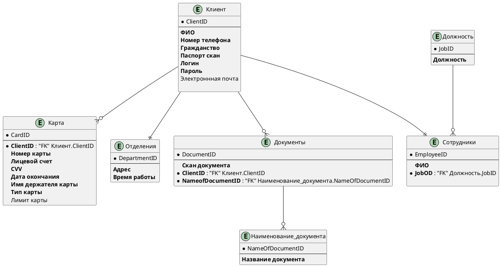

# Домашнее задание 5 ERD

## ER Diagramm Заказ карты для физического лица через мобильное приложение с выдачей в отделении

```plantuml
@startuml
entity "Клиент" as e1{
    *ClientID
    --
    **ФИО**
    **Номер телефона**
    **Гражданство**
    **Паспорт скан**
    **Логин**
    **Пароль**
    Электроннная почта
    
}
entity "Карта" as e2{
    *CardID
    --
    * **ClientID** : "FK" Клиент.ClientID
    **Номер карты**
    **Лицевой счет**
    **CVV**
    **Дата окончания**
    **Имя держателя карты**
    **Тип карты**
    Лимит карты
}

entity "Отделения" as e3{
    *DepartmentID
    --
    **Адрес**
    **Время работы**
}


entity "Сотрудники" as e4 {
    *EmployeeID
    --
    **ФИО**
    * **JobOD** : "FK" Должность.JobID

}

entity "Должность" as e5 {
    *JobID
    --
    **Должность**
}

entity "Документы" as e6 {
    * DocumentID
    --
    **Скан документа**
    * **ClientID** : "FK" Клиент.ClientID
    * **NameofDocumentID** : "FK" Наименование_документа.NameOfDocumentID
}

entity "Наименование_документа" as e7{
    * NameOfDocumentID
    --
    **Название документа**
}

e1 --o{ e2
e1 --|| e3
e1 --|| e4
e5 --o{ e4
e1 --o{ e6
e6 --o{ e7
@enduml
```

