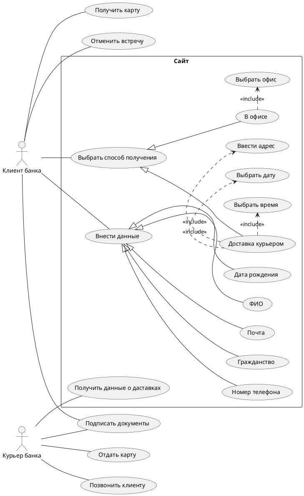
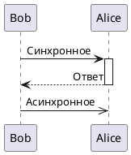

# Домашнее задание 4 UML

## Use Case

```plantuml
@startuml
left to right direction
actor "Клиент банка" as cl
actor "Курьер банка" as kr
rectangle Сайт{
    usecase "Внести данные" as UC1
    usecase "Почта" as UC2
    usecase "ФИО" as UC3
    usecase "Дата рождения" as UC4
    usecase "Номер телефона" as UC5
    usecase "Гражданство" as UC6
    usecase "Выбрать способ получения" as UC7
    usecase "В офисе" as UC8
    usecase "Доставка курьером" as UC9
    usecase "Получить данные о даставках" as UC13
    usecase "Выбрать офис" as UC16
    usecase "Выбрать дату" as UC17
    usecase "Выбрать время" as UC18
    usecase "Ввести адрес" as UC19
    UC8 .> UC16 : <<include>>
    UC9 .> UC17 : <<include>>
    UC9 .> UC18 : <<include>>
    UC9 .> UC19 : <<include>>
}
cl -- UC1
UC1 <|-- UC2
UC1 <|-- UC3
UC1 <|-- UC4
UC1 <|-- UC5
UC1 <|-- UC6
cl -- UC7
UC7 <|-- UC8
UC7 <|-- UC9
usecase "Получить карту" as UC10
usecase "Отменить встречу" as UC11
usecase "Подписать документы" as UC12
usecase "Отдать карту" as UC14
usecase "Позвонить клиенту" as UC15
cl -- UC10
cl -- UC11
cl -- UC12
kr -- UC12
kr -- UC13
kr -- UC14
kr -- UC15
@enduml
```

## Sequence

```plantuml
@startuml
skinparam sequenceMessageAlign right
Bob -> Alice : Синхронное
activate Alice
Alice --> Bob : Ответ
deactivate Alice
Bob ->> Alice : Асинхронное
@enduml
```