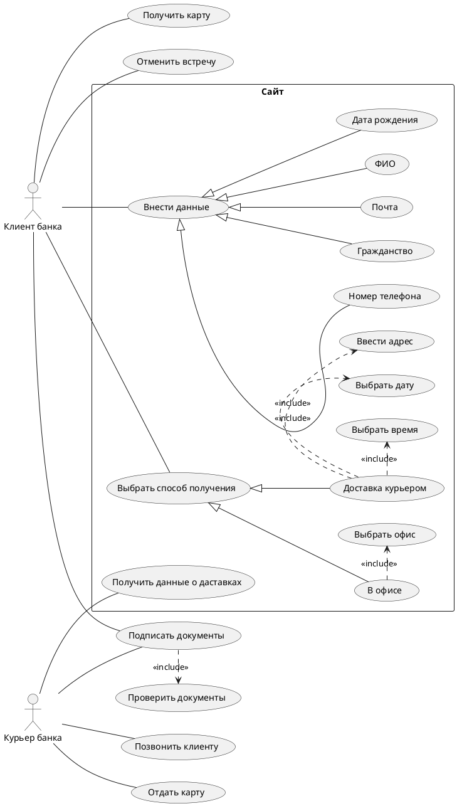
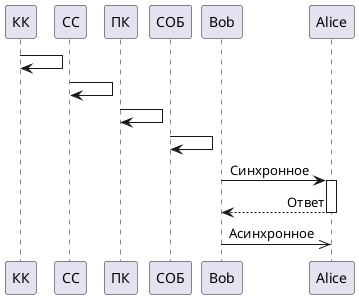
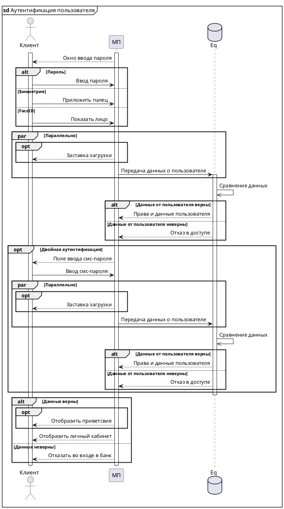
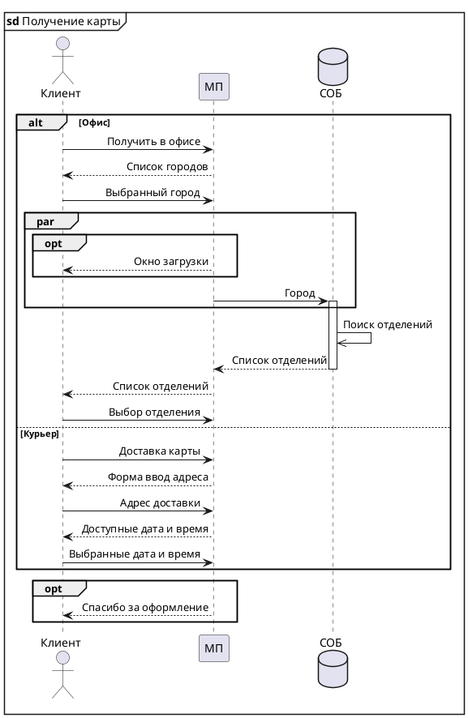
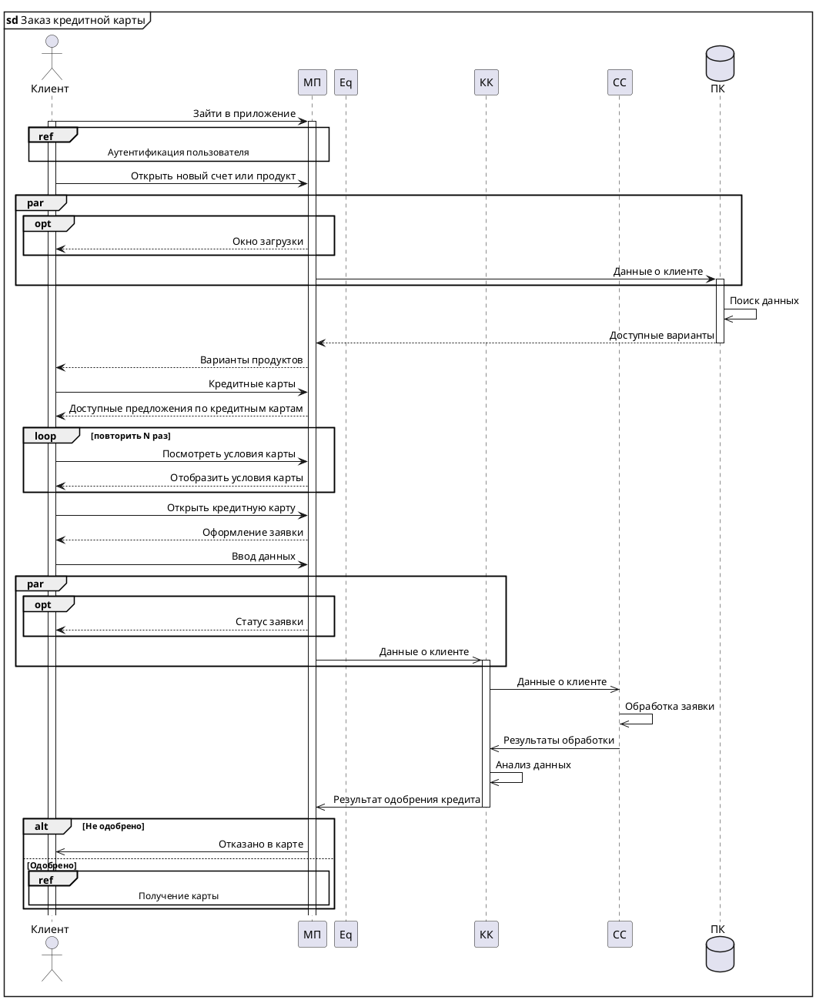

# Домашнее задание 4 UML

## Use Case

```plantuml
@startuml
left to right direction
actor "Клиент банка" as cl
actor "Курьер банка" as kr
rectangle Сайт{
    usecase "Внести данные" as UC1
    usecase "Почта" as UC2
    usecase "ФИО" as UC3
    usecase "Дата рождения" as UC4
    usecase "Номер телефона" as UC5
    usecase "Гражданство" as UC6
    usecase "Выбрать способ получения" as UC7
    usecase "В офисе" as UC8
    usecase "Доставка курьером" as UC9
    usecase "Получить данные о даставках" as UC13
    usecase "Выбрать офис" as UC16
    usecase "Выбрать дату" as UC17
    usecase "Выбрать время" as UC18
    usecase "Ввести адрес" as UC19
    UC8 .> UC16 : <<include>>
    UC9 .> UC17 : <<include>>
    UC9 .> UC18 : <<include>>
    UC9 .> UC19 : <<include>>
}
cl -- UC1
UC1 <|-- UC2
UC1 <|-- UC3
UC1 <|-- UC4
UC1 <|-- UC5
UC1 <|-- UC6
cl -- UC7
UC7 <|-- UC8
UC7 <|-- UC9
usecase "Получить карту" as UC10
usecase "Отменить встречу" as UC11
usecase "Подписать документы" as UC12
usecase "Отдать карту" as UC14
usecase "Позвонить клиенту" as UC15
usecase "Проверить документы" as UC20
cl -- UC10
cl -- UC11
cl -- UC12
kr -- UC12
kr -- UC13
kr -- UC14
kr -- UC15
UC12 .> UC20 : <<include>>
@enduml
```

## Sequence

```plantuml
@startuml
skinparam sequenceMessageAlign right

КК -> КК
СС -> СС
ПК -> ПК
СОБ -> СОБ
Bob -> Alice : Синхронное
activate Alice
Alice --> Bob : Ответ
deactivate Alice
Bob ->> Alice : Асинхронное
@enduml
```

## Sequence "Аутентификация пользователя"

```plantuml
@startuml
skinparam sequenceMessageAlign right
actor Клиент as cl
participant "МП"  as mp
database Eq as eq

mainframe **sd** Аутентификация пользователя
activate cl
activate mp
mp --> cl : Окно ввода пароля
alt Пароль  
    cl -> mp : Ввод пароля
else Биометрия
    cl -> mp : Приложить палец
else FaceID  
    cl -> mp : Показать лицо 
end

par Параллельно
    opt
        mp --> cl : Заставка загрузки
    end
    mp -> eq : Передача данных о пользователе
    activate eq
end
eq ->> eq : Сравнение данных
alt Данные от пользователя верны
    eq --> mp : Права и данные пользователя
else Данные от пользователя неверны
    eq --> mp : Отказ в доступе
end
opt Двойная аутентификация
    mp --> cl : Поле ввода смс-пароля
    cl -> mp : Ввод смс-пароля 
    par Параллельно
    opt
        mp --> cl : Заставка загрузки
    end
    mp -> eq : Передача данных о пользователе
    end
    eq ->> eq : Сравнение данных
    alt Данные от пользователя верны
        eq --> mp : Права и данные пользователя
    else Данные от пользователя неверны
        eq --> mp : Отказ в доступе
    end
end
    deactivate eq
alt Данные верны
    opt 
        mp --> cl : Отобразить приветсвие
    end
    mp --> cl : Отобразить личный кабинет
else Данные неверны
    mp --> cl : Отказать во входе в банк
end
deactivate mp
deactivate cl
@enduml
```

## Sequence "Получение карты"

```plantuml
@startuml
skinparam sequenceMessageAlign right
actor Клиент as cl
participant МП  as mp
database СОБ as sob

mainframe **sd** Получение карты
alt Офис
    cl -> mp : Получить в офисе 
    mp --> cl : Список городов
    cl -> mp : Выбранный город
    par
        opt
            mp --> cl : Окно загрузки
        end
        mp -> sob : Город
        activate sob
    end
    sob ->> sob : Поиск отделений
    sob --> mp : Список отделений
    deactivate sob
    mp --> cl : Список отделений
    cl -> mp : Выбор отделения
else Курьер
   cl -> mp : Доставка карты
   mp --> cl : Форма ввод адреса
   cl -> mp : Адрес доставки
   mp --> cl : Доступные дата и время
   cl -> mp : Выбранные дата и время
end
opt
        mp --> cl : Спасибо за оформление
    end


@enduml
```

## Sequence "Заказ банковской карты"

```plantuml
@startuml
skinparam sequenceMessageAlign right
actor Клиент as cl
participant МП  as mp
participant Eq as eq
participant КК as kk
participant СС as cc
database ПК as pk

mainframe **sd** Заказ кредитной карты
cl -> mp : Зайти в приложение
activate cl
activate mp
ref over cl, mp
    Аутентификация пользователя
end ref
cl -> mp : Открыть новый счет или продукт
par
    opt
        mp --> cl : Окно загрузки
    end
    mp -> pk : Данные о клиенте
    activate pk
end
pk ->> pk : Поиск данных
pk --> mp : Доступные варианты
deactivate pk

mp --> cl : Варианты продуктов
cl -> mp : Кредитные карты
mp --> cl : Доступные предложения по кредитным картам
loop повторить N раз
    cl -> mp : Посмотреть условия карты
    mp --> cl : Отобразить условия карты
end
cl -> mp : Открыть кредитную карту
mp --> cl : Оформление заявки
cl -> mp : Ввод данных
par
    opt
        mp --> cl : Статус заявки
    end
    mp ->> kk : Данные о клиенте
    activate kk
end

kk ->> cc : Данные о клиенте
cc ->> cc : Обработка заявки
cc ->> kk : Результаты обработки
kk ->> kk : Анализ данных
kk ->> mp : Результат одобрения кредита
deactivate kk
alt Не одобрено
    mp ->> cl : Отказано в карте
else Одобрено
    ref over cl, mp 
        Получение карты
    end ref
end
@enduml
```